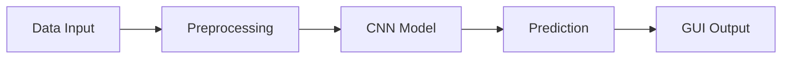

# AI Egg Fertility Classification
## Deep Learning Algorithm Implementation for Chicken Egg Fertility Classification

[](https://python.org)
[](https://tensorflow.org)
[](https://flutter.dev)
[](LICENSE)

## Project Description

This project develops an automated classification system to distinguish between fertile and infertile chicken eggs using Deep Learning technology with Convolutional Neural Network (CNN) architecture. The system is designed to improve efficiency and accuracy in the poultry industry, replacing traditional candling methods that rely on operator skills.

### Main Objectives
- **Accuracy >95%**: CNN model with 96% accuracy on testing dataset
- **Inference Speed <0.5 seconds**: Optimization for real-time usage
- **Offline Capability**: Mobile application that can run without internet connection
- **Intuitive Interface**: User-friendly GUI for non-technical users

## Development Team (Group 11)

| Name | Student ID | Role |
|------|------------|------|
| **Destina Manurung** | 11322004 | Project Manager & Data Scientist |
| **Christian Gultom** | 11322036 | Machine Learning Engineer |
| **Hagai Sianturi** | 11322063 | Mobile Developer & UI/UX |

**D3 Information Technology Study Program**  
**Vocational Faculty - Institut Teknologi Del**  
**Laguboti, 2025**

## Key Features

### Mobile Application
- **Real-time Detection**: Live detection from camera (30 FPS)
- **Gallery Analysis**: Image analysis from device gallery
- **Confidence Score**: Display confidence score (0-100%)
- **Offline Operation**: Functions without internet connection

### AI Model
- **CNN Architecture**: Sequential model with 3 convolutional layers
- **Total Parameters**: 4,828,481 trainable parameters
- **Mobile Optimization**: Converted to TensorFlow Lite for optimal performance

## Technology Stack

### Backend & AI
- **TensorFlow 2.10 + Keras**: Deep learning model development
- **OpenCV 4.7**: Image processing and analysis
- **Google Colab Pro (GPU Tesla T4)**: Model training platform
- **Roboflow**: Dataset augmentation

### Frontend & Mobile
- **Flutter**: Mobile application development framework
- **TensorFlow Lite**: Mobile model optimization
- **PyQt5**: Desktop GUI for development

## Model Performance Results

### Evaluation Metrics
```
Accuracy: 96.0%
Precision (Fertile): 96.3%
Recall (Fertile): 96.3%
F1-Score (Fertile): 96.3%
```

### Confusion Matrix
```
                Predicted
Actual      Fertile  Infertile
Fertile        26        1
Infertile       1       22
```


## Dataset Structure

```
dataset/
├── train/          # 1,362 images
│   ├── fertile/    # 699 fertile egg images
│   └── infertile/  # 663 infertile egg images
├── valid/          # 50 images for validation
└── test/           # 50 images for testing
```

### Data Augmentation
- Random rotation (-15° to +15°)
- Horizontal/vertical shear (±10°)
- Random zoom (0-20%)
- Auto-orientation
- Uniform resolution (150×150 pixels)

## System Architecture



### CNN Model Architecture


1. **Conv2D Layer 1**: 32 filters (148×148×32)
2. **MaxPooling2D**: Reduce to (74×74×32)
3. **Conv2D Layer 2**: 64 filters (72×72×64)
4. **MaxPooling2D**: Reduce to (36×36×64)
5. **Conv2D Layer 3**: 128 filters (34×34×128)
6. **MaxPooling2D**: Reduce to (17×17×128)
7. **Flatten**: Convert to 1D vector
8. **Dense Layer**: 128 neurons
9. **Output Layer**: 1 neuron (sigmoid activation)

## System Requirements

### Minimum Requirements
| Platform | Requirement |
|----------|-------------|
| **Android** | API Level 24+ (Android 7.0) |
| **RAM** | 2GB minimum |
| **GPU** | NNAPI support (recommended) |

### Tested Devices
- Xiaomi Redmi Note 10 (Android 12)
- Samsung Galaxy A Series
- Google Pixel devices

## Installation & Usage

### 1. Clone Repository
```bash
git clone https://github.com/T0MM11Y/AI-Egg-Fertility-Classification.git
cd AI-Egg-Fertility-Classification
```

### 2. Setup Environment
```bash
# Install dependencies
pip install -r requirements.txt

# Setup Flutter environment (for mobile app)
flutter pub get
```

### 3. Download Pre-trained Model
- TensorFlow Model: `model/egg_classifier.h5`
- TFLite Model: `model/egg_classifier.tflite`

### 4. Run Application
```bash
# Desktop version
python main.py

# Mobile version
flutter run
```

## Download APK

**[Download Demo Application](https://drive.google.com/file/d/1Fl-cpigO6duf8Nz68-Gum1jm7R6nuDgm/view?usp=drivesdk)**

## Project Structure

```
AI-Egg-Fertility-Classification/
├── dataset/                    # Egg dataset
├── model/                      # Trained models
│   ├── egg_classifier.h5       # TensorFlow model
│   └── egg_classifier.tflite   # TensorFlow Lite model
├── mobile_app/                 # Flutter mobile application
├── notebooks/                  # Jupyter notebooks
│   └── training.ipynb          # Model training notebook
├── src/                        # Source code
│   ├── preprocessing.py        # Data preprocessing
│   ├── model.py               # Model architecture
│   └── utils.py               # Utility functions
├── docs/                      # Documentation
├── requirements.txt           # Python dependencies
└── README.md                  # Project documentation
```

## Research Methodology

### Training Configuration
- **Optimizer**: Adam (learning rate: 0.001)
- **Loss Function**: Binary Crossentropy
- **Metrics**: Accuracy
- **Epochs**: 20
- **Batch Size**: 32
- **Callbacks**: EarlyStopping, ModelCheckpoint

### Data Processing Pipeline
1. **Data Collection**: Fertile/infertile egg dataset
2. **Preprocessing**: Resize, normalization, augmentation
3. **Model Training**: CNN with 3 convolutional layers
4. **Evaluation**: Testing with confusion matrix
5. **Deployment**: Convert to TFLite for mobile

## Training Results

The model showed consistent accuracy improvement:
- **Epoch 1-5**: Accuracy increased from 73% to 94.35%
- **Epoch 6-10**: Reached 97.94% accuracy
- **Final Model**: 96% testing accuracy with minimal loss

## Contributing

We welcome contributions to this project:

1. Fork the repository
2. Create a feature branch (`git checkout -b feature/AmazingFeature`)
3. Commit your changes (`git commit -m 'Add some AmazingFeature'`)
4. Push to the branch (`git push origin feature/AmazingFeature`)
5. Create a Pull Request

## License

This project is licensed under the MIT License - see the [LICENSE](LICENSE) file for details.

## References

### Dataset Source
- **Eggs3 Dataset v1** (2024-11-14)
- Roboflow Universe

### Documentation Links
- [TFLite Flutter Documentation](https://pub.dev/packages/tflite_flutter)
- [Source Code Notebook](https://colab.research.google.com/drive/m4in.ipynb)
- [Flutter Development Guide](https://flutter.dev/docs)

## Contact

**Institut Teknologi Del**  
Email: [email-kelompok@del.ac.id]  
Website: [https://www.del.ac.id](https://www.del.ac.id)  
Address: Laguboti, Toba Samosir, North Sumatera

---

<div align="center">

**Optimizing Poultry Industry with Artificial Intelligence**

*Developed with care by Group 11 IT D3 Institut Teknologi Del*

</div>
